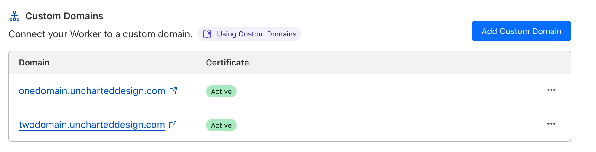

# Multiple domains on a non-production Front End Site

## Prerequisites

- A Pantheon account with a hosted site.
- A domain with DNS managed by Cloudflare.

## Setup Instructions

### Setting up Pantheon
1. **Create Front End Site**
    - Push a branch beginning with `multi-` to create a stable URL to use for the development environment

### Setting Up Cloudflare

1. **Configure DNS**:
   - Ensure your primary domain uses Cloudflare as its DNS provider.
   - Log in to your Cloudflare account and select your domain.

2. **Create a Cloudflare Worker**:
   - Navigate to "Workers & Pages" and select "Create Worker".
   - Copy and paste the provided worker code into the Cloudflare Worker editor.
   - Replace `https://multi-test-multidomain.appa.pantheon.site/` in the worker code with your actual Pantheon site URL.

3. **Deploy the Worker**:
   - Once you've edited the worker with your specific details, save and deploy it.

4. **Add Custom Domain to Worker**:
   - Under the Worker settings, navigate to "Triggers".
   - Add your custom domain(s) to route through the worker. This involves specifying which subdomains or paths trigger this worker.
   

## Verifying Your Setup

- After setting up your Cloudflare worker and configuring your domain, visit your subdomains to ensure they correctly proxy to your Pantheon site.
- Check the response headers of your requests for the custom header (`X-My-Header`) to verify that your Cloudflare Worker is processing requests as expected.

For more detailed information and advanced configurations, refer to the [Cloudflare Workers Documentation](https://developers.cloudflare.com/workers/)


Cloudflare worker code:

```js
export default {
async fetch(request, env, ctx) {
const url = new URL(request.url);
const hostname = url.hostname;

    // Example of extracting the subdomain
    const subdomain = hostname.split('.')[0]; // Assuming 'subdomain.example.com'

    // Define your Pantheon site URL here
    const pantheonSiteUrl = 'https://multi-test-multidomain.appa.pantheon.site/';

    // If you need to route different subdomains to different paths, you can modify this logic
    // For simplicity, this example uses the same Pantheon site for all subdomains
    const targetUrl = new URL(pantheonSiteUrl);
    targetUrl.pathname = `${url.pathname}`;

    // make subrequests with the global `fetch()` function
    // Pass along the original request headers and method
    console.log(targetUrl.toString());
    let res = await fetch(targetUrl.toString(), {
      method: request.method,
      headers: request.headers,
      body: request.body
    });

    // Optionally, modify the response or add custom headers
    // This example adds a header but keeps the original response body and status
    const modifiedRes = new Response(res.body, {
      status: res.status,
      statusText: res.statusText,
      headers: res.headers
    });
    modifiedRes.headers.set('X-My-Header', 'My Header Value');

    return modifiedRes;

},
};
```